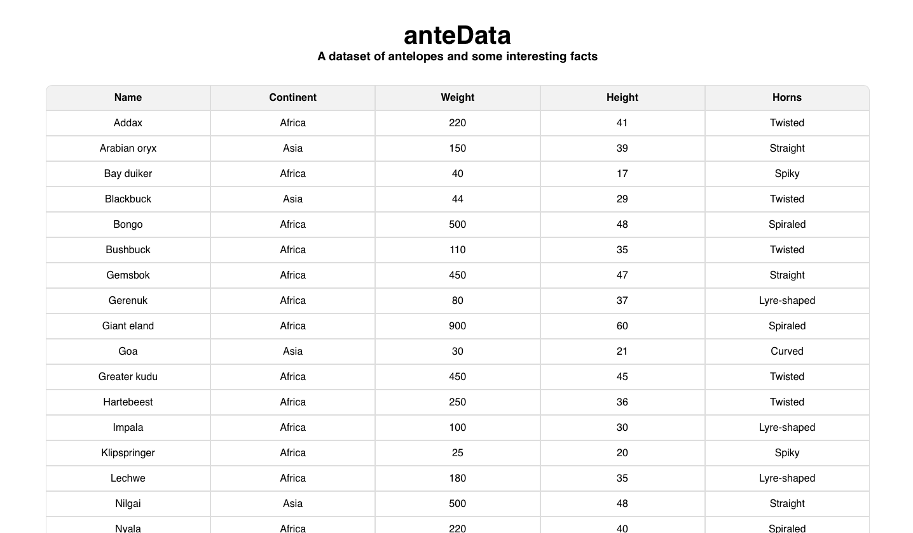
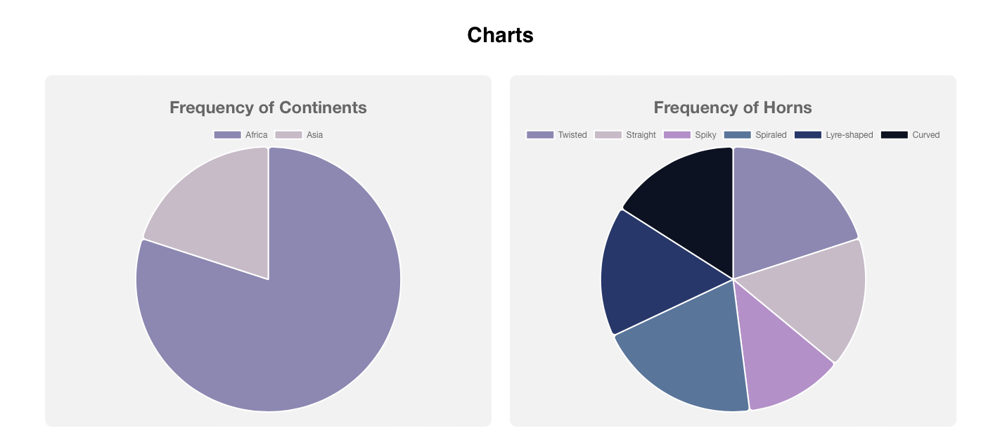
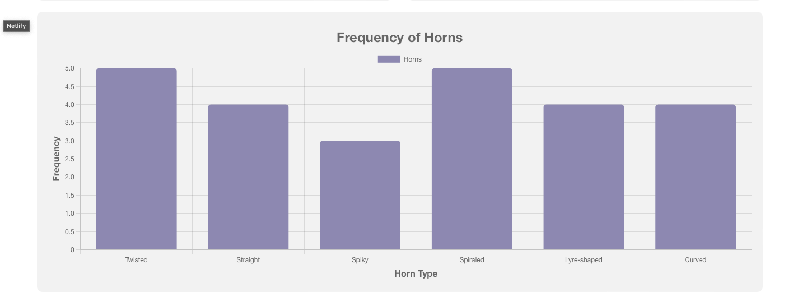
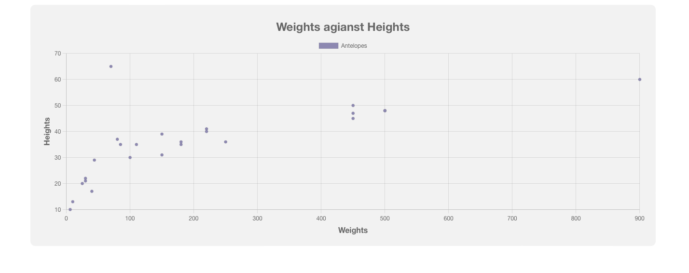

# anteData
## Some interesting facts about antelopes

## How to run locally

#### run `git clone https://github.com/yawok/animated-disco.git` in your terminal

#### run `cd animated-disco` to move to the project directory

In the project directory, you can run:

#### `npm install`

and then 
#### `npm start`

## Functional Features
### 1. Sortable Table:
The table displays antelope data in rows, with columns for name, continent,
weight, height, and horn type.
Each column header is clickable for sorting the table data based on that
column.
When hovering over the antelope name, a tooltip displays the antelope's
picture.

### 2. Pie Charts:
Frequency of continents: A pie chart showing the distribution of antelopes across different continents.
Frequency of horn types: A pie chart showing the distribution of horn types among antelopes.

### 3. Bar Chart:
Frequency of horn types: A bar chart showing the frequency of different horn
types among antelopes. 

### 4. Scatter Chart:
Weights against heights: A scatter chart showing the relationship between antelope weights and heights.

## Gallery
### The sortable table

### The Charts

